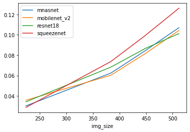

NoName:
---
Patrick Fernandes, Jared Fernandez, Haoming Zhang, Hao Zhu

1: Models
----
* BERT
* AlBERT
* DistilBERT
* Longformer
* mobilenet_V2
* resnet18
* squeezenet
* vgg16

TODO: make hypothesis. examples: (a) longformer will not consume much more memory/latency per sequence size

2: Parameter count
----

* AlBERT: 11.7M
* BERT: 109.5M
* distilBERT: 66.4M
* longformer: 148.7M
* mnasnet: 4.4M
* mobilenet_v2: 3.5M
* resnet18: 11.7M
* squeezenet: 1.2M

No difficulties were found when computing total parameters

3: Latency
----

Latency while varying image size and batch size for computer vision models is plotted below.




Latency while varying image size and batch size for natural langugage / transformer models is plotted below. 
Since Longformer was major outlier, we also plot latency vs batch size without it.


The main problem came from the memory requirments for transformer models.
 We suspect that, for example, the latency of longformer is due to swap usage and we can see that we cannot even run it for batch size > 2. 
Other transformers run out of space at batch size > 4.


4: Energy use
----
1. Compute the energy use of each model. You can use the `powertop` tool on RPi and Jetson (must be run as root):
    ```
    sudo apt install powertop
    ```
    and/or the `jtop` tool on Jetson (see installation instructions [here](https://github.com/rbonghi/jetson_stats/)). 
    
    Follow the same procedure as you used to compute latency, but this time compute energy: (avg) watts * time. You will likely need to sample power a number of times throughout each inference, and average.
    
    By default, `powertop` takes measurements every 20 seconds. You can change it with the `--time` parameter, which specifies number of seconds and allows for non-integer intervals (0.5 for half a second) e.g. to poll every second for 10 seconds and write to 10 csv files:
    ```
    sudo powertop --time=1 --csv=powertop.log --iteration=10
    ```
    Here is a link to the [`powertop` users guide](https://01.org/sites/default/files/page/powertop_users_guide_201412.pdf) [PDF].
2. Any difficulties you encountered here? Why or why not?

5: Discussion
----

TODO: discuss hypothesis

5: Extra
----
A few options:
1. Compute FLOPs for each of your models. If you're using Transformer-based models, you might be able to use or modify the [`flops_counter.py`]() script in this directory. If you're using a CNN-based model, then you might be able to use or modify code in [this project](https://github.com/1adrianb/pytorch-estimate-flops) or similar. 
2. Evaluate on different hardware (for example, you might run the same benchmarking on your laptop.) Compare the results to benchmarking on your device(s).
3. Use real evaluation data and compare accuracy vs. efficiency. Describe your experimental setup in detail (e.g. did you control for input size? Batch size? Are you reporting average efficiency across all examples in the dev set?) Which model(s) appear to have the best trade-off? Do these results differ from benchmarking with synthetic data? Why or why not?

----
\* There are exceptions to this rule, where it may be important to include data loading in benchmarking, depending on the specific application and expected use cases. For the purposes of this lab, we want to isolate any data loading from the inference time due to model computation.
