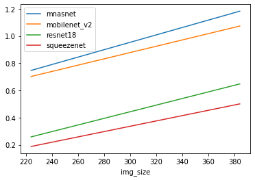
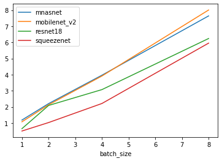
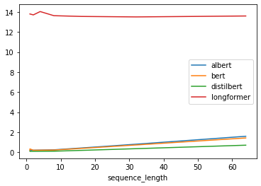
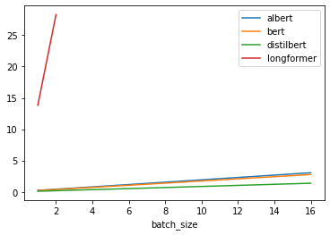

Lab 3: Quantization
===
NoName:
---
Patrick Fernandes, Jared Fernandez, Haoming Zhang, Hao ZhuGroup name:

1: Models & Model Size
----

**TODO**: Add parts quantitized in each model

model: original precision, orginal model size, target precision, parts quantitized

* BERT: float32, 418M, int8, [Self-Attention Layers, Fully Connected Layers] 
* AlBERT: float32, 45M, int8,  [Self-Attention Layers, Fully Connected Layers] 
* DistilBERT: float32, 254M, int8,  [Self-Attention Layers, Fully Connected Layers] 
* Longformer: float32, 568M, int8,  [Self-Attention Layers, Fully Connected Layers] 
* mobilenet_V2: float32, 14M, int8, [Conv2D, Fully Connected Layers]
* resnet18: float32, 45M, int8, [Fully Connected Layers]
* squeezenet: float32, 4.8M, int8, [Fully Connected Layers]
* mnasnet: float32, 17M, int8, [Fully Connected Layers]

**TODO**: Add hypothesis

2: Quantization in PyTorch
----

We had some problems with the the QNNPack not being included in the wheel we were using. Reinstalling PyTorch with the wheel provided solved it. For the transformer language models, dynamic quantization was applied without any additional problems. Quantization was applied to all self-attention and fully connected layers -- because the self-attention heads are implemented as linear layers within the HuggingFace library.  

Furthermore, we were unable to use the torchvision quantized models for all image models as only MobileNetv2 was quantized using QNNPack, other models were quantized using FBGEMM which our torch installation was not built with.
As a result, the quantization for the remaining vision models as only applied to the final fully connected layer. This still provided substantial savings in memory footprint because the linear layer contained the largest number of parameters.  

3: Model Size
* BERT: 174M
* AlBERT: 23M
* DistilBERT: 132M 
* Longformer: 262M
* mobilenet_V2: 10M
* resnet18: 44M
* squeezenet: 4.8M
* mnasnet: 14M

4: Latency
----
Latency while varying image size and batch size for computer vision models is plotted below.

Latency while varying image size and batch size for natural langugage / transformer models is plotted below. 
Since Longformer was major outlier, we also plot latency vs batch size without it.

Initially we were suprised by the fact that quantized models were *slower* than the original model. 
However after realizing that quantized models run on the CPU, this made sense.
We then recomputed the values for the originial models *on the CPU* to compare (see plots below), and here we see the expected behaviour.

5: Discussion
----

**TODO** Add discussion

6: Extra
----

### Static Quantization

**TODO**: Get this implemented in Jareds framework

### Server Data

For comparison against high-performance systems we ran the same benchmarks using quantized models on a deep learning server with an Intel Xeon W-2295 CPU and with 128 GB of RAM.

Latency while varying image size and batch size for computer vision models is plotted below.

Latency while varying image size and batch size for natural langugage / transformer models is plotted below. 

We can see that results on the server are mostly the same as for the Jetson. **TODO**: Elaborate

