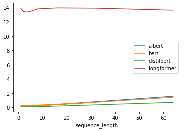

Lab 3: Quantization
===
NoName:
---
Patrick Fernandes, Jared Fernandez, Haoming Zhang, Hao ZhuGroup name:

1: Models
----

**TODO**: Add quantitized parts

* BERT: fp32, qint8, TODO
* AlBERT: fp32, qint8, TODO
* DistilBERT: fp32, qint8, TODO
* Longformer: fp32, qint8, TODO
* mobilenet_V2: fp32, qint8, TODO
* resnet18: fp32, qint8, TODO
* squeezenet: fp32, qint8, TODO

We chose the same models as the previous lab. 

**TODO**: Hypothesis for models

2: Quantization in PyTorch
----

We had some problems with the the QNNPack not being included in the wheel we were using. Reinstalling PyTorch with the wheel provided solved it

3: Model size
----

**TODO**: Add checkpoint size for all models

4: Latency
----
Latency while varying image size and batch size for computer vision models is plotted below.

Latency while varying image size and batch size for natural langugage / transformer models is plotted below. 
Since Longformer was major outlier, we also plot latency vs batch size without it.

Initially we were suprised by the fact that quantized models were *slower* than the original model. 
However after realizing that quantized models run on the CPU, this made sense.
We then recomputed the values for the originial models *on the CPU* to compare (see plots below), and here we see the expected behaviour.

5: Discussion
----

**TODO** Add discussion

5: Extra
----

### Static Quantization

**TODO**: Get this implemented in Jareds framework

### Server Data

For comparison against high-performance systems we ran the same benchmarks using quantized models on a deep learning server with an Intel Xeon W-2295 CPU and an Nvidia RTX-8000 GPU (48 GB VRAM) with 128 GB of RAM.

Latency while varying image size and batch size for computer vision models is plotted below.

Latency while varying image size and batch size for natural langugage / transformer models is plotted below. 

We can see that results on the server are mostly the same as for the Jetson. **TODO**: Elaborate

