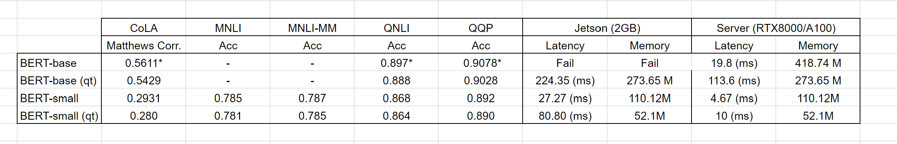

Lab 4: Baselines
===
NoName:
---
Patrick Fernandes, Jared Fernandez, Haoming Zhang, Hao Zhu

1: Related Work
----
## Adaptive Computation

- [BERT](https://arxiv.org/pdf/1810.04805.pdf)

BERT is a pretrained Transformers language model that learns bidirectional representations from unlabeled text by jointly conidtioning on both left and right context in all layers. It is pretrained on  13 GB text data with a combination of masked LM loss and next sentense prediction loss. The pretrained BERT can be finetuned with one additional output layer for various of downstream tasks. BERT is evaluated on benchmark datasets, including GLUE and SQuAD, and achieves state-of-the-art performances at the time. 

As a lot of follow-up works, our project aims to build upon BERT and improve the performance of BERT on resource limited devices, such as Jetson Nano. From our preliminary experiments, running BERT-base on 2GB Jetson Nano leads to out of memory. Our hypothesis is that we can run BERT-base's inference computation graph on a 2GB device by iteratibely instantiaing the model's parameters. Also, our experiments for adaptive computing with hardware features will uild upon BERT.

- [RoBERTa](https://arxiv.org/pdf/1907.11692.pdf)

RoBERTa presents a replication study of BERT. The authors pretrained the model with several modifications durign pretraining, which include:  (1) training the model longer, with bigger batches, over more data; (2) removing the next sentence prediction objective; (3) training on longer sequences; and (4) dynamically changing the masking pattern applied to the training data. The work shows that the original BERT is undertrained and it achieves better performance than BERT in nearly all the downstream tasks. For our project, we will use RoBERTa as another pretrained model target for our adaptive computing experiments. 

- [ALBERT](https://arxiv.org/pdf/1909.11942.pdf)

ALBERT proposes two parameter reduction techniques to address the memory limitation problem in scaling pretrained language models, BERT specifically. The first one is decomposing the vocabulary embedding matrix into two small matrix, which allows growing the hidden size without siginicantly increasing the parameter size of vocabulary embeddings. The second technique is cross-layer parameter sharing, which prevents the parameter from growing with the depth of the network. With these two techniques, the authors ends up with models with less parameters, lower latencies, comparable or even better performance than BERT. Similar as RoBERTa, we is ALBERT as another another pretrained model target for our adaptive computing experiments in this project.

- [DistilBERT](https://arxiv.org/pdf/1910.01108.pdf)

DistillBERT is a smaller transformer-based model trained through knowledge distillation from BERT. It is trained with a combination of three different losses: distillation loss, masked LM loss, and cosine embedding loss. The model ends up to be 40% smaller than a BERT model, while  retaining 97% of its language understanding capabilities and being 60% faster. DistillBERT provides a smaller, faster and lighter model suitable for on-device computations. In our project, we will compare our iterative ayer instatiation method to DistillBERT as an alternative on-device solution with zero loss in performance but higher latency. 

- [DeeBERT](https://aclanthology.org/2020.acl-main.204.pdf)

DeeBERT introduces the technique of dynamic early exiting to accelerate BERT Inference. Specifically, it inserts extra classification layers (referred as off-ramps) between each transformer layer of BERT during training. At inference time, the model will output the prediction of the first off-ramp where the entropy of the probavility distribution is less than the preset threshold. This method saves up to 40% inference time for both BERT and RoBERTa with minimal degradation in model quality. For the adaptive computing part of our project, we will build upon DeeBERT by including time constraints and hardware features during training. We will compare our experiment results to DeeBERT and hope to see some improvement in performance.

- [BERT Loses Patience](https://arxiv.org/pdf/2006.04152.pdf)

Similar as DeeBERT, PABEE adopted early exiting method to accelerate BERT Inference. Rather than comparing entropy to threshold at inference time, PABEE exits with the output of an off-ramp layer when the intermediate predictions of the internal classifiers remain unchanged for t times consecutively, where t is a pre-defined patience. For experiments on ALBERT, PABEE can even improve the perfermance on downstream tasks, while speeding up inference time simultaneously. For our project, we will use PABEE as the baseline for our adaptive computing part.

- [ZeRO-Offload](https://arxiv.org/pdf/1910.02054.pdf)

In order to enable the training of models with large numbers of parameters (in the billons) on a single gpu, ZeRO-Offload introduces a set of techniques that offload both memory and computation to the CPU. The partition is choosen to minimize the communication bottleneck between CPU and GPU and CPU load while maximizing GPU memory savings. They prove that their method achieves the best possible memory savings for a given communication bottleneck and cpu load and show they can train models 9x larger than before.

In particular two points distinguish this from our work: (1) The offloading is done between GPU and CPU, which has the benifit of being able to do computation on the model parameters since they are still stored in dynamic memory. In contrast our method is concern with offloading memory from the RAM to persistant memory, which makes it more dificult since we information needed for the algorithm needs to be computed apriori (2) they algorithm is *static* in the sense that after the partition is done, a part of the model either lives in CPU or GPU. In contrast our method will be dynamic, iteratively moving memory parts from persistent memory to RAM and vice versa.

- [SwapAdvisor](http://www.news.cs.nyu.edu/~jinyang/pub/swapadvisor-asplos20.pdf)

SwapAdvisor is another algorithm that attempts to solve the problem of tensor allocation between GPU and CPU. Similar to our approach, this is a dynamic method, focusing on switching tensors in-and-out as needed. They approach the problem as an optimization problem, using genetic algorithms to find an scheduler that minimises computation time and show that they are able to train models 12x the size the GPU memory, while keeping throughoup at worst at 50%.

While this work is somewhat more similar to our proposed approach, it still relies mostly on the assumpution of a GPU/CPU dichotomy, while our approach is concerned with the case where only RAM is available and it's very small. Also their experiments are mostly done on a training context, while we are mostly focused an inference scenario.

2: Baselines
----

As a general test bed we will consider models in BERT family as baselines and we will evaluate the performance the GLUE benchmark, and in particular on the CoLA, MNLI, MNLI-MM, QNLI, QQP tasks. We will evaluate the model in terms of accuracy, memory usage and latency.
In particular given the two apparent *branches* of the project we will consider two slightly different variations as baselines

## Iterative Model Deserialization

For baselines for iterative model deserialization and experiments with the memory capabilities of the Jetson board, we will consider a BERT-base and a [BERT-small](https://arxiv.org/abs/1908.08962) model to evaluate the tradeoff between memory usage and performance. We will evaluate on the NVIDIA Jetson 2Gb since this more memory constrained scenario is suited for our proposed approeach. We also run evaluations on a server for comparison.

Experiments for latency and memory usage were performed with batch size == 1. We profiled for memory using `torch.profiler` for more accurate measure of memory usage and latency is averaged across all test samples across all test sets.
We will also experiment with quantitized versions of these models.

Given our previous knowledge of the Jetson 2Gb board, we expect that the BERT-base won't fit, while BERT-base-qt will fit but will be slower due to only working on the CPU. BERT-small will fit, will be faster and use less memory than BERT-base but will be less accurate. 

### Results

The table below shows the results for the baseline

We can see that results are pretty much as expected. BERT-base beats BERT-small in all tasks, and the un-quantitized models slightly outperforming their quantitized counterparts. 

In terms of memory and latency, as expected the BERT-base models are much slower and consume much more memory than the BERT-small models. 
The quantitized models consume less memory BUT since they run on the CPU, are actually slower than their unquantitized counterparts. 
Due to the size of the BERT-base model, we were unable to run it on the Jetson 2GB, with the computation constantly hitting SWAP, making our case for iterative model deserialization stronger. Therefor results for BERT-base were computed on the server, but should theorically be the exact same as if ran on the Jetson.

Interestingly, the accelarator on the NVIDIA Jetson 2Gb seems to be slower than the CPU on the server (albeit this could be due to the model being quantitized OR a bottleneck in memory or other places)

### Problems faced

Unfortunatly, the server used for finetuning the BERT model was affected by performance issues the last few days. Therefor we were unable to fine-tune a BERT-based on MNLI. We expect to have this in the next week

This also lead us to move some of the experiments mid-way to new server. 
Therefor experiments with the BERT-small model were peformed on a server with a A100 while experiment with BERT-base were performed on server with an RTX8000. 
However while this might affect the relative peformance between the base and small model, we believe much of the conclusion will be the same.

## Adaptive Computation

We used PABEE (code available at [link](https://github.com/huggingface/transformers/tree/master/examples/research_projects/bert-loses-patience)) from a pretrained ALBERT model as our baseline for the adaptive computation branch. We will adopt a pretrained ALBERT checkpoint from transformers library. We will use a machine learning server with an Nvidia RTX-8000 GPU to fine-tune the model with PABEE implementation for patience-based early exit on MNLI, MNLI-MM, QNLI, QQP, and CoLA tasks from GLUE benchmark datasets, with the original train test splits. We fine-tune each model for 5 epochs and then evaluate models on our 4GB Jetson Nano device. 

To ensure that the early exit baselines are able to run on device, we use an ALBERT-based model to verify the performance behavior of the early-exit models. 

After training the baselines on clusters, we will evaluate the models on 4GB Jetson Nano device, with the corresponding validation data for each downstream task. We will compare the latency and GLUE score with the original ALBERT models to evaluate the performance of PABEE. We report the accuracy and the relative speedups of a full 12-layer ALBERT model and ALBERT model with patience-based early-exit off ramps.

The early-exit model using BERT-based did not fit on device. To extend the early exit framework to larger models such as BERT, we will merge the adaptive computing work with the previously discussed deserialization framework. For a baseline early-exit model that did fit in memory, we used ALBERT due to it's smaller overhead from tied parameteres.

While we were able to complete the desired baseline runs, we did run into challenges where even an ALBERT model was close to max utilization and OOM issues which required frequent rebooting and clearing cached memory. There were additional challenges in GLUE evaluation libraries which required compilation of Python libraries from their source. 

On average, single example inference took between 5-10 ms per iteration and saw RAM utilization between 3.2 and 3.4 GB of the Jetson's 4GB shared memory. 

| Task    | Full Inference Accuracy | PABEE Accuracy | PABEE Speedup |
|---------|-------------------------|----------------|---------------|
| CoLA    | 53.93                   | 54.16          | 1.23x         |
| MNLI    | 84.35                   | 84.36          | 1.16x         |
| MNLI-MM | 84.13                   | 84.34          | 1.16x         |
| QNLI    | 90.37                   | 90.43          | 1.32x         |
| QQP     | 90.64                   | 90.69          | 1.48x         |

The speedups of PABEE match our expectations. However, the speedup and accuracy improvements only occur when using a patience value of 6 or 7 which suggests that the model is still running near twice the ideal amount of computation. In our experiments, we intend to revise the PABEE off-ramp formulation to include better estimation of both the model confidence and penalties for additional computation to encourage more aggressive changes in compute requirements. The OOM memory issues from larger models validates our intuition that progressive loading of models is necessary.

3: Future Work
----

The next weeks will go by creating a unified framework for both braches of our experiments. 
This includes picking experiment with models mentioned on the related work on both branches.

For iterative model deserialization, we will start to work on a prototype checkpoint processor that formats a checkpoint to be have external metadata without requiring the loading of the whole checkpoint. Also early experiments with how memory is distributed across layers will be performed, as well as giving thought to the framework necessary for peforming computation on partial computation graph.

**TODO**(adaptive)
